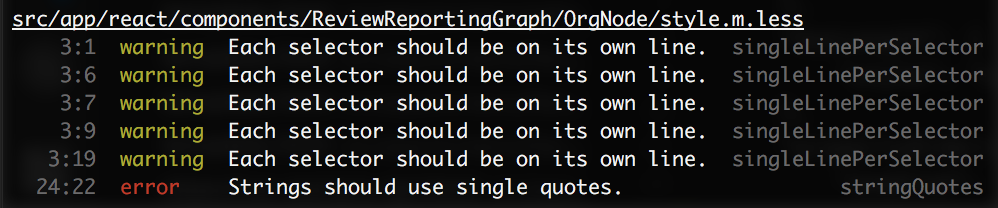
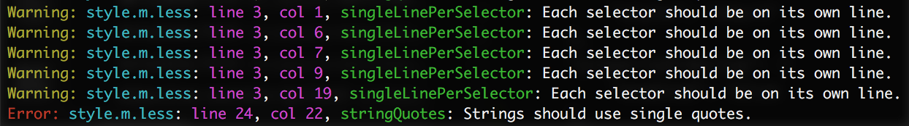

# lesshint-reporter-stylisher

Reporter for [lesshint](https://github.com/lesshint/lesshint). An alternative to the [official one](https://github.com/lesshint/reporter-stylish) that tries to mimic the default eslint reporter a bit closer.



Compared to [lesshint-reporter-stylish](https://github.com/lesshint/reporter-stylish):



## Install

```bash
npm install lesshint-reporter-stylisher --save-dev
```

## Usage

```bash
lesshint --reporter lesshint-reporter-stylisher
```
